# 👋 Hi, I'm Seona Ann Tom

### Computer Science Undergraduate | Backend Developer | AI & API Integration

🎓 B.Tech Computer Science & Engineering student at KTU  
💻 Software Development Intern at Repatria  
🔧 Building backend systems, REST APIs, and AI-powered applications  
🌱 Currently exploring Backend Engineering, AI Integration & Cloud Technologies  
📍 India

---

## 👩‍💻 About Me

I'm a Computer Science undergraduate interested in building practical software
systems, with a focus on **backend development, API integration, databases,
and AI-powered applications**.

Currently, I'm working as a **Software Development Intern at Repatria**, where
I develop backend services and conversational AI workflows using:

- Node.js & Express.js
- PostgreSQL & Prisma ORM
- REST APIs
- Gemini API
- Google Maps API
- Flutter integration

I enjoy working on problems involving **data, APIs, system workflows,
debugging, and intelligent automation**.

I'm also exploring **Machine Learning, Computer Vision, NLP, and Cloud
Technologies** alongside my software development journey.

---

## 💻 Tech Stack

### Languages

### Backend & APIs

### Databases

### AI / Machine Learning

### Frontend & Mobile

### Tools & Technologies

---

## 👩‍💼 Leadership

### Learning Coordinator — TinkerHub VJCET

- Organized and facilitated **15+ technical workshops and state-level
  hackathons**
- Reached **600+ students**
- Led Women in Tech initiatives
- Organized a **100+ participant** pre-hackathon meetup and hackathon

---

## 🌱 Currently Learning

- Backend Engineering
- System Design
- AI & LLM Integration
- Cloud Deployment
- Computer Vision
- Natural Language Processing
- Database & API Optimization

---

## 📊 GitHub Stats

  
  

---

## 📈 GitHub Contribution Graph

  

---

## 🤝 Let's Connect

💼 [LinkedIn](YOUR_LINKEDIN_URL)

💻 [GitHub](https://github.com/seonaann)

---
